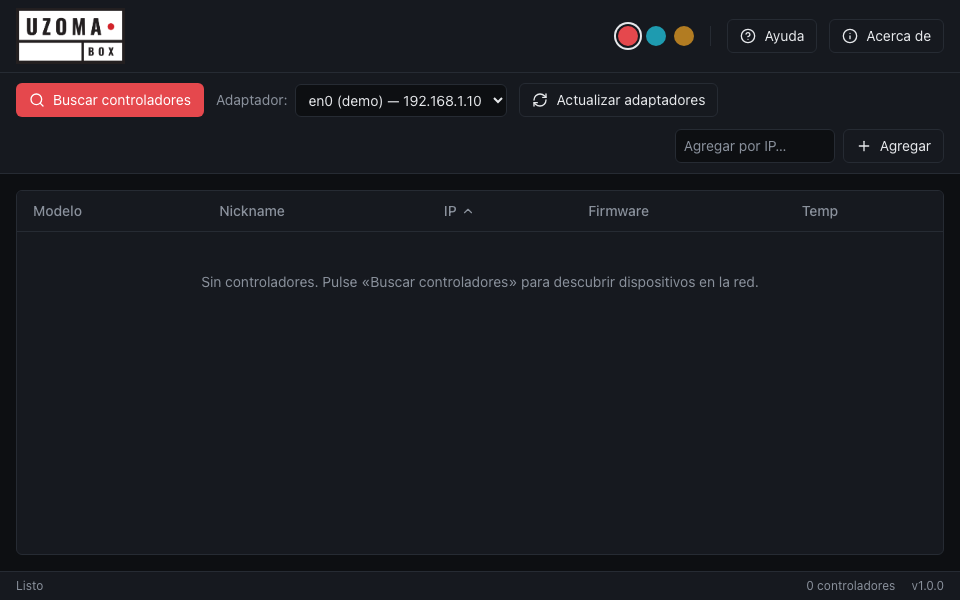

# UzomaBox Assistant

Aplicación de escritorio (Tauri 2 + React 18 + TypeScript) para descubrir y configurar controladores LED Art-Net **UzomaBox** (Teensy 4.1) por TCP/UDP. Interfaz inspirada en Advatek PixLite Assistant.

> **Esta es la reescritura desde cero (v2) del proyecto [uzoma_box](https://github.com/uzomamozu/uzoma_box)** — la app de escritorio ahora es standalone (Tauri + Rust + React, sin Python). Roadmap: **Fase 1** (este repo, v1.0.0/M1) app de escritorio completa contra el firmware actual; **Fase 2** reescritura del firmware (PlatformIO) con protocolo v2 y salida DMX512.



## Requisitos

- Node.js 20+ y npm 9+
- Rust stable (vía rustup). Cargo no está en el `PATH` por defecto: hay que hacer `source $HOME/.cargo/env` en cada terminal antes de usar comandos de Rust.
- Xcode Command Line Tools (macOS)

## Puesta en marcha

```bash
npm install

# Terminal 1 — simulador de dispositivo (UDP 7777 + TCP 8888, protocolo v1 completo)
npm run sim

# Terminal 2 — aplicación de escritorio en modo desarrollo
source $HOME/.cargo/env
npm run tauri dev
```

### Firewall de macOS (OBLIGATORIO para que el discovery funcione)

El Application Firewall de macOS **descarta silenciosamente los datagramas UDP entrantes hacia binarios sin firma**: la app envía `UZOMA:SEARCH` pero nunca ve las respuestas (la tabla queda vacía). Además, ALF no honra reglas sobre binarios sin firmar, así que el binario debe estar **firmado** (basta firma ad-hoc) y tener su regla de firewall.

Esto ya está **automatizado**, no requiere pasos manuales:

- `src-tauri/.cargo/config.toml` registra un *runner* de cargo (`scripts/cargo-run-signed.sh`) que **firma el binario justo antes de ejecutarlo** en cada `cargo run`/`cargo test` — es decir, `npm run tauri dev` siempre arranca la app firmada, aunque recompile.
- La firma usa el identificador estable `dev.uzomabox.assistant`, así que la regla de firewall (creada una sola vez por `scripts/sign-dev.sh`, que pide tu contraseña) sigue valiendo entre recompilaciones.
- Si alguna vez ejecutas el binario directamente sin cargo, corre `npm run sign:dev` antes.
- Diagnóstico: `src-tauri/examples/udp_diag.rs` (`cargo run --example udp_diag`) prueba ida y vuelta UDP; el test `cargo test -- --ignored collects_simulator_replies` valida el discovery contra el simulador (requiere estar en la misma subred). En producción esto no aplica: la `.app` firmada con Developer ID (M4) no necesita nada de esto.

**Nota de red**: el discovery es por broadcast — la Mac y el dispositivo deben estar en la **misma subred** (p. ej. el UzomaBox físico en `192.168.1.211` solo aparece cuando la Mac está en `192.168.1.x`). Si cambias de red, pulsa «Actualizar adaptadores» o reinicia la app.

Otros scripts:

- `npm run dev` — solo el frontend (Vite, <http://localhost:5173>), con datos de demostración si no hay backend Tauri.
- `npm run build` — typecheck (tsc) + build de producción del frontend.
- `npm run sim` — simulador UzomaBox sin dependencias (`simulator/uzomabox-sim.mjs`).
  - Modo **protocolo v2** (firmware nuevo M5+): `npm run sim -- --proto2` (o
    `UZOMA_SIM_PROTO=2`). Añade `HELLO`, `proto=2`/`mac`/`temp` en STATUS,
    patrones de test 5–6 y los comandos **DMX512** (`DMX:ENABLE=0|1`,
    `DMX:UNIVERSE=n`) con su estado reflejado en `dmx_enabled`/`dmx_universe`
    — permite probar la sección DMX de la pestaña ArtNet (visible solo con
    `proto≥2`) sin hardware. El modo por defecto sigue siendo v1 puro.

## Estructura del proyecto

```
uzomabox-assistant/
├── horz.png / vert.png        # Logos originales (no modificar; se copian a src/assets)
├── package.json               # Scripts: dev, build, tauri, sim
├── index.html                 # Entrada Vite (título: UzomaBox Assistant)
├── vite.config.ts / tsconfig.json / tailwind.config.js / postcss.config.js
├── simulator/
│   └── uzomabox-sim.mjs       # Simulador del dispositivo (protocolo v1 completo)
├── scripts/
│   └── sign-dev.sh            # Firma ad-hoc del binario dev + regla de firewall (tras cada recompilación)
├── src/
│   ├── main.tsx / App.tsx     # Entrada React y enrutado por ventana (?device=<ip>)
│   ├── index.css              # Temas (variables CSS + data-theme) y clases base
│   ├── assets/                # Copias de los logos usadas por la app
│   ├── i18n/                  # Catálogos de cadenas ES/EN + test de paridad
│   │   ├── es.ts              # Español (define el tipo Strings)
│   │   ├── en.ts              # English (cumple Strings)
│   │   └── index.ts           # Binding vivo `t` + setI18nLang
│   ├── store/appStore.ts      # Estado global (Zustand): dispositivos, conexiones, tema
│   ├── lib/
│   │   ├── ipc.ts             # Wrappers de comandos Tauri + suscripción a eventos (con filtro por IP)
│   │   ├── actions.ts         # Acciones de UI (descubrir, agregar IP, abrir ventana de dispositivo…)
│   │   ├── protocol.ts        # Lógica pura: validadores IP/MAC, CSV, matemática de universos
│   │   ├── protocol.test.ts   # Tests vitest de protocol.ts (`npm test`)
│   │   └── hooks.ts           # useSyncedValue (dirty flags) y useRebootWatch (ciclo de reinicio)
│   └── components/
│       ├── Header.tsx         # Logo horizontal, selector de tema (3 paletas), Ayuda/Acerca de
│       ├── MainView.tsx       # Vista principal (toolbar + tabla)
│       ├── Toolbar.tsx        # Buscar controladores, adaptador, actualizar, agregar por IP
│       ├── DeviceTable.tsx    # Tabla ordenable + menú contextual (sin columna Temp, ver notas)
│       ├── ContextMenu.tsx    # Menú contextual genérico
│       ├── StatusBar.tsx      # Barra de estado inferior
│       ├── AboutDialog.tsx    # Diálogo Acerca de (logo vertical)
│       ├── HelpDialog.tsx     # Diálogo de ayuda
│       ├── controls.tsx       # Section, Field, Notice, TabShell, ConfirmDialog
│       ├── DeviceView.tsx     # Vista de dispositivo (ventana propia) + tira de pestañas
│       └── tabs/
│           ├── GeneralTab.tsx # General: nickname, IP/MAC, info, reinicio
│           ├── LedsTab.tsx    # LEDs: ancho de tira, orden de color, mapa de salidas (output_count filas)
│           ├── ArtNetTab.tsx  # ArtNet: modo + FPS en vivo
│           ├── TestTab.tsx    # Test: patrón/salida/modo test
│           ├── StatusTab.tsx  # Estado: grid STATUS, Identify (+ pista), consola TX/RX
│           └── PlaceholderTab.tsx  # Marcador M3 (Playback, Grabación)
└── src-tauri/
    ├── Cargo.toml / tauri.conf.json / build.rs
    ├── capabilities/default.json  # Permisos Tauri 2: core + bus de eventos (sin esto listen() es rechazado y la app queda muda)
    ├── icons/icon.png
    └── src/
        ├── main.rs            # Comandos Tauri (incl. open_device_window) + ciclo de vida de la app
        ├── protocol.rs        # Protocolo de líneas v1 (encode/decode + tests)
        ├── discovery.rs       # Descubrimiento UDP 7777 (broadcast UZOMA:SEARCH)
        ├── connection.rs      # Worker TCP persistente por dispositivo (reconexión, PING, STATUS)
        └── events.rs          # Payloads de eventos hacia el frontend
```

## Notas de arquitectura

- **Multi-ventana por controlador** (estilo Advatek): la ventana principal solo lista controladores; doble clic o «Abrir configuración» invoca `open_device_window`, que crea (o enfoca, sin duplicar) una ventana OS `device-<ip>` con URL `?device=<ip>` (~940×760). Cada ventana tiene su propio contexto JS/store y filtra eventos por IP (`wireEvents(ip)`); al cerrarse, Rust desconecta el dispositivo vía hook de `WindowEvent::Destroyed` (limpieza robusta aunque React no se desmonte).
- **Cero E/S de red en el hilo de UI**: todos los sockets viven en Rust (tokio). El frontend solo invoca comandos (`list_adapters`, `discover`, `add_manual_device`, `connect`, `disconnect`, `send_command`, `identify`, `open_device_window`) y se suscribe a eventos (`device_found`, `discovery_status`, `connection_state`, `latency`, `status_update`, `log_line`).
- El firmware solo admite **un cliente TCP** a la vez: el worker cierra el socket limpiamente al desconectar o cerrar la ventana/app.
- **Pestañas del dispositivo**: General (antes «Red»: nickname, IP/MAC, reinicio), LEDs, ArtNet, Test, Estado funcionales; Playback y Grabación llegan en M3.
- **Temperatura oculta**: el firmware v1 siempre envía `TEMP=0` (sin sensor cableado), así que la UI no la muestra (ni columna en la tabla ni fila en General). Se sigue parseando/guardando en el store para cuando la Fase 2 exponga el sensor interno del Teensy.
- **Tabla de salidas (LEDs)**: muestra exactamente `output_count` filas; los `CONFIG:*` CSV siempre envían las 16 entradas, conservando en las filas ocultas los últimos valores conocidos de STATUS (`buildCsvPreserving` en `lib/protocol.ts`).
- **Idioma ES/EN**: selector segmentado en la barra superior, persistido en `localStorage`. Las cadenas viven en `src/i18n/` (`es.ts` define el tipo `Strings`, `en.ts` lo cumple, `index.ts` expone el binding vivo `t`); un test de vitest garantiza la paridad de claves entre idiomas.
- **Tema único fijo**: paleta `electric-cyan` como variables CSS en `:root` (`src/index.css`); sin selector de tema.
- **wry vendorizado** (`src-tauri/vendor/wry` + `[patch.crates-io]` en `Cargo.toml`): wry 0.55.1 con el parche de [tauri-apps/wry#1744](https://github.com/tauri-apps/wry/pull/1744) — sin él, la app abortaba (`panic_cannot_unwind` en `url_scheme_handler::start_task`) cuando WebKit entregaba una petición de esquema con URL/método/header nil, típicamente al abrir la vista de dispositivo. Quitar cuando una release oficial de wry incluya el fix.

## Empaquetado (instaladores)

### DMG local (macOS)

```bash
source $HOME/.cargo/env
rustup target add aarch64-apple-darwin   # una sola vez, para el build universal
npm run tauri build -- --target universal-apple-darwin
# sin --target: build solo para la arquitectura actual (más rápido)
```

El DMG queda en `src-tauri/target/universal-apple-darwin/release/bundle/dmg/` (build universal) o `src-tauri/target/release/bundle/dmg/` (build nativo). Los iconos se generan desde el logo vertical: `npm run tauri icon <png-cuadrado>`. El bundle se firma ad-hoc (`bundle.macOS.signingIdentity: "-"` en `tauri.conf.json`) para que el firewall pueda registrarla por identificador.

### CI (GitHub Actions)

`.github/workflows/release.yml` construye los instaladores al publicar un tag `v*`: **macOS** (dmg universal) y **Windows** (msi/nsis), y los sube al GitHub Release del tag (`softprops/action-gh-release`). Para publicar: `git tag v1.1.0 && git push origin v1.1.0`.

### Avisos de primera ejecución (instaladores sin firma de desarrollador)

Los instaladores salen con **firma ad-hoc** hasta que se añadan los certificados (Apple Developer ID / EV) como secrets:

- **macOS**: Gatekeeper avisará ("app de desarrollador no identificado") — abrir con clic derecho → Abrir. **Ojo con el firewall (ALF): NO muestra diálogo para apps ad-hoc y bloquea el discovery UDP en silencio** (la tabla sale vacía). Si aparece el diálogo de "permitir conexiones entrantes", acéptalo; si no, otorga el permiso a mano una sola vez:
  ```bash
  sudo /usr/libexec/ApplicationFirewall/socketfilterfw --add "/Applications/UzomaBox Assistant.app"
  sudo /usr/libexec/ApplicationFirewall/socketfilterfw --unblockapp "/Applications/UzomaBox Assistant.app"
  ```
- **Windows**: SmartScreen avisará ("Windows protegió su PC") → Más información → Ejecutar de todas formas. El firewall de Windows sí mostrará su diálogo habitual de red — aceptar.
